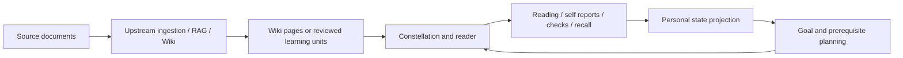

# WeKnora · Personal Knowledge & Guided Learning

English | [简体中文](README_CN.md)

**Turn a document knowledge base into a personal learning workspace: find a starting point, follow a focused path, and keep reading progress separate from demonstrated understanding.**

This is [Lh0326's fork](https://github.com/Lh0326/WeKnora) of [Tencent/WeKnora](https://github.com/Tencent/WeKnora). The default branch, `topic4-final`, adds a **knowledge network and guided learning prototype** to WeKnora 0.7.2. Document ingestion, RAG, agents, and Wiki infrastructure come from upstream; the learning extension is the focus of this repository.

[Learning guide](README_LEARNING.md) · [Design](docs/learning-design.md) · [Reproducible evaluation](docs/evaluation/learning-prototype/README.md) · [Submission metadata](submission.yaml)

## What this fork adds

| Capability | Implemented behavior |
|---|---|
| Source-grounded learning units | Goals, explanations, applicable conditions, source references, and reviewed prerequisite relationships; generated candidates require review before publication |
| Personal learning state | Reading, self reports, independent checks, and recall are tracked separately; reading alone does not certify mastery |
| Guided next steps | Select a focus goal, respect its prerequisite closure, and plan feasible actions within an internal budget; recompute after recorded actions |
| Knowledge constellation | Explore personal state through the constellation, reader, learning history, and path panel |
| Spaced review | Schedule reviews with FSRS using actual recall feedback |
| Personal data controls | View, stop collection, export HTML/JSON, and delete personal records, scoped to the authenticated subject and tenant |

Knowledge bases without reviewed learning units still support page-based reading navigation. A pack without checks can support reading and recall; optional checks do not block new reading.

## How it fits together



The backend is Go; the frontend is Vue 3 + TypeScript. The extension uses the existing database and authentication services and adds no standalone service. See the [design note](docs/learning-design.md) for evidence rules and planning constraints.

## Quick start: build this fork

The learning extension requires this branch's **backend and frontend source**. An upstream release image alone does not include it.

Use Linux, macOS, or a Linux environment under WSL2, with Git, Bash, Docker Compose v2, and Node.js 22.12+ in the 22.x line (or a compatible newer version) with npm. Docker needs sufficient resources and network access to build the Go backend and document parser; the frontend assets are built on the host.

### 1. Get the source and configure it

```bash
git clone --branch topic4-final --single-branch https://github.com/Lh0326/WeKnora.git
cd WeKnora
cp .env.example .env
```

Edit `.env` before starting:

- Add `LEARNING_ENABLE=true` to enable the learning backend.
- Set `WEKNORA_VERSION=v0.7.2` to match the upstream baseline. The build below produces local images containing this fork under that tag.
- Replace the example database/Redis passwords and `JWT_SECRET`; set `SYSTEM_AES_KEY` to a private 32-byte value and keep it stable.
- Keep the default PostgreSQL retrieval and local storage for the initial setup. Configure model access in the UI after login.
- Set `LANGFUSE_ENABLED=false` unless you are configuring Langfuse; the template contains placeholder tracing credentials.

Use a **fresh database** for the first run. Learning migrations are PostgreSQL 000087–000101 and SQLite 000013–000027. Databases from earlier experimental topic branches require a separate migration plan; see [migration details](README_LEARNING.md).

### 2. Build and start

```bash
bash scripts/build_frontend_dist.sh
docker compose build app frontend docreader
docker compose up -d --no-build --pull missing
docker compose ps
```

The frontend image copies `frontend/dist`, so the asset build must finish first. The backend runs the normal migrations at startup when `AUTO_MIGRATE=true` (the default). Avoid pulling upstream app/UI images over these locally built images; rebuild from this checkout when updating the extension.

Open [the local Web UI](http://localhost) (or your configured `FRONTEND_PORT`). Register or sign in, configure chat and embedding models, then create a knowledge base and add source material. Open its learning view to inspect available pages or units and record a reading action. A new or unprocessed knowledge base may show an empty learning view.

### 3. Add reviewed learning units

An authorized knowledge-base writer can request candidates through `POST /api/v1/learning/kb/:kb_id/components/draft`. Review goals, conditions, quotations, and relationships before importing a pack. See the [learning guide](README_LEARNING.md) and [API routes](internal/router/routes_learning.go) for the existing draft/import workflow.

For source development and hot reload, use the [development guide](docs/开发指南.md). General platform usage remains documented in [the product documentation](website-docs/README.md).

## Source map

| Location | Responsibility |
|---|---|
| [Learning services](internal/application/service/learning/) | State projection, learning units, planning, and review scheduling |
| [Learning routes](internal/router/routes_learning.go) | Authenticated personal learning APIs |
| [Learning UI](frontend/src/views/knowledge/learning/) | Constellation, reader, progress, and next steps |
| [Learning types](internal/types/learning.go) | Data structures and persistence models |
| [Migrations](migrations/) | PostgreSQL and SQLite schema changes |
| [Evaluation runner](scripts/evaluate_learning_prototype.py) | Reproducible checks and planning comparisons |

## Validation and limitations

The [validation guide](docs/evaluation/learning-prototype/README.md) provides a runner for source fingerprints, constraint regressions, and synthetic planning comparisons:

```bash
python scripts/evaluate_learning_prototype.py --out .local-data/evaluation/run-001
```

It requires the project Go/CGO toolchain (including SQLite development headers), Python 3, and installed frontend dependencies. The output directory must not already exist. PostgreSQL checks require a dedicated empty test database supplied through `LEARNING_TEST_POSTGRES_DSN`; missing prerequisites, failed checks, and skipped checks remain visible in the report. Frontend type checking and builds are separate steps in the guide.

- Generated learning units need source and semantic review.
- Scores are prototype estimates, not calibrated ability probabilities or certificates.
- Planning bounds describe feasible combinations for a selected goal, not optimal goal selection.
- Synthetic checks and public-dataset experiments do not establish improved human learning outcomes.

For independent outcome measurement, see [the assessment workflow](docs/evaluation/objective-learning/README.md).

## Upstream and license

Based on WeKnora 0.7.2 at `fc9d6f8c347c7fb15017e0157dfabf565fb68524`. The frozen submission tag is `rhino-2026-final-4`; [submission.yaml](submission.yaml) records its commit. README maintenance on the default branch does not alter that tag.

Upstream capabilities and credits remain documented in [the baseline README](https://github.com/Tencent/WeKnora/blob/fc9d6f8c347c7fb15017e0157dfabf565fb68524/README.md), [CHANGELOG](CHANGELOG.md), and [product documentation](website-docs/README.md). The Japanese and Korean READMEs describe the upstream platform; use this page or the Chinese README for this fork's learning extension.

Licensed under [MIT, with the third-party terms listed in LICENSE](LICENSE).
