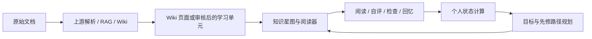

# WeKnora · 个人知识网络与引导式学习

[English](README.md) | 简体中文

**把文档知识库变成个人学习工作台：找到阅读起点、围绕目标持续学习，并区分“读过了”和“有证据理解了”。**

本仓库是 [Lh0326](https://github.com/Lh0326/WeKnora) 基于 [Tencent/WeKnora](https://github.com/Tencent/WeKnora) 的二次开发项目。默认分支 `topic4-final` 在 WeKnora 0.7.2 上增加**知识网络与引导式学习原型**。文档解析、RAG、Agent 和 Wiki 属于上游基础能力，本仓库重点展示个人学习扩展。

[功能与运行说明](README_LEARNING.md) · [设计文档](docs/learning-design.md) · [可复现评估](docs/evaluation/learning-prototype/README.md) · [提交信息](submission.yaml)

## 本项目增加了什么

| 能力 | 实际实现 |
|---|---|
| 有来源的学习单元 | 组织目标、解释、适用条件、来源引用和经审核的先修关系；生成的候选需要审核后发布 |
| 个人学习状态 | 分开记录阅读、自我反馈、独立检查与真实回忆；阅读记录不直接认定为掌握 |
| 下一步学习引导 | 选择一个焦点目标，在必要先修范围与内部预算内规划可行动作，并在记录动作后重算 |
| 知识星图 | 通过星图、阅读器、学习轨迹和路径面板查看同一份个人状态 |
| 间隔复习 | 基于真实回忆反馈，通过 FSRS 安排下次复习 |
| 个人数据管理 | 按认证用户与租户隔离，支持查看、停止采集、导出 HTML/JSON 和删除个人记录 |

没有经过审核的学习单元时，知识库仍可使用 Wiki 页面阅读导航。没有检查题的学习包也可支持阅读与回忆；可选检查不会阻断继续阅读。

## 工作流程



后端使用 Go，前端使用 Vue 3 + TypeScript。学习扩展复用现有数据库和认证服务，无需增加独立服务。证据规则与规划约束见[设计文档](docs/learning-design.md)。

## 快速开始：运行本分支

学习扩展需要构建本分支的**后端和前端源码**。仅拉取上游发布镜像无法获得这部分功能。

准备 Linux、macOS 或 WSL2 中的 Linux 环境，以及 Git、Bash、Docker Compose v2、Node.js 22.x 中的 22.12+ 版本（或兼容的更新版本）和 npm。Docker 需要足够的资源与网络连接来构建 Go 后端和文档解析服务；前端静态资源在宿主机构建。

### 1. 获取源码与配置

```bash
git clone --branch topic4-final --single-branch https://github.com/Lh0326/WeKnora.git
cd WeKnora
cp .env.example .env
```

启动前编辑 `.env`：

- 添加 `LEARNING_ENABLE=true`，启用学习后端。
- 将 `WEKNORA_VERSION` 设为 `v0.7.2`，与上游基线一致。下方构建步骤会在本地生成带有本分支代码的同名镜像。
- 替换示例中的数据库、Redis 密码和 `JWT_SECRET`；将 `SYSTEM_AES_KEY` 设置为私有的 32 字节值并妥善保留。
- 首次体验可保留 PostgreSQL 检索和本地文件存储；登录后在界面中配置模型。

首次运行建议使用**全新数据库**。学习迁移编号为 PostgreSQL 000087–000101、SQLite 000013–000027。早期课题实验分支的数据库需要单独制定迁移方案，详见[迁移说明](README_LEARNING.md)。

### 2. 构建并启动

```bash
bash scripts/build_frontend_dist.sh
docker compose build app frontend docreader
docker compose up -d --no-build --pull missing
docker compose ps
```

前端镜像直接复制 `frontend/dist`，必须先完成静态资源构建。`AUTO_MIGRATE=true`（默认值）时，后端启动会执行标准数据库迁移。不要在构建后再用上游 app/UI 镜像覆盖本地镜像；更新学习扩展时应重新构建本分支。

打开[本地 Web 界面](http://localhost)（或自行配置的 `FRONTEND_PORT`），注册或登录，配置对话与嵌入模型，再创建知识库、导入材料。进入知识库的学习视图，查看可用页面或单元并记录一次阅读。新建或尚未处理材料的知识库可能显示空学习视图。

### 3. 添加审核后的学习单元

具有知识库写权限的用户可通过 `POST /api/v1/learning/kb/:kb_id/components/draft` 请求候选。导入学习包前，应审核目标、适用条件、引用与关系。现有草拟和导入流程见[学习说明](README_LEARNING.md)与[接口路由](internal/router/routes_learning.go)。

需要本地源码开发与热重载时，参考[开发指南](docs/开发指南.md)；平台通用功能参考[产品文档](website-docs/README.md)。

## 源码导航

| 位置 | 职责 |
|---|---|
| [学习服务](internal/application/service/learning/) | 状态计算、学习单元、路径规划与复习调度 |
| [学习路由](internal/router/routes_learning.go) | 经过认证的个人学习 API |
| [学习界面](frontend/src/views/knowledge/learning/) | 星图、阅读器、进度与下一步推荐 |
| [学习数据结构](internal/types/learning.go) | 数据结构与持久化模型 |
| [数据库迁移](migrations/) | PostgreSQL 与 SQLite 表结构变更 |
| [评估入口](scripts/evaluate_learning_prototype.py) | 可复现检查与规划比较 |

## 验证与适用边界

[验证指南](docs/evaluation/learning-prototype/README.md)提供统一入口，记录源码指纹、约束回归与合成规划比较：

```bash
python scripts/evaluate_learning_prototype.py --out .local-data/evaluation/run-001
```

需要项目的 Go/CGO 工具链（含 SQLite 开发头文件）、Python 3 与已安装依赖的前端。输出目录必须尚不存在。PostgreSQL 专项检查需要通过 `LEARNING_TEST_POSTGRES_DSN` 指向独立的空测试库；缺失前置条件、失败和跳过都会保留在报告中。前端类型检查与构建按指南另行执行。

- 生成的学习单元需要来源与语义审核。
- 分数属于原型估计，不能解释为经过校准的能力概率或认证。
- 规划上界针对已选目标内的可行组合，不代表目标选择最优。
- 合成测试和公开数据集实验不能直接证明真人学习效果提升。

独立效果评估方法见[评估工作流](docs/evaluation/objective-learning/README.md)。

## 上游与许可证

基于 WeKnora 0.7.2，基线提交为 `fc9d6f8c347c7fb15017e0157dfabf565fb68524`。冻结提交标签为 `rhino-2026-final-4`，对应提交记录在 [submission.yaml](submission.yaml)；默认分支上的 README 维护不改变该标签。

上游能力与致谢见[基线中文 README](https://github.com/Tencent/WeKnora/blob/fc9d6f8c347c7fb15017e0157dfabf565fb68524/README_CN.md)、[更新日志](CHANGELOG.md)和[产品文档](website-docs/README.md)。日文与韩文 README 介绍上游平台，本 Fork 的学习扩展以本页和英文 README 为准。

采用 [MIT 许可证及 LICENSE 中列明的第三方许可条款](LICENSE)。
