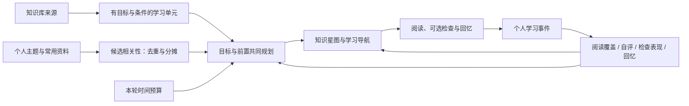

# 第二轮：关联、依赖预算规划与真实页面

2026-09-12。本记录补充第一轮模型对照；不覆盖真实学习收益或通用材料语义质量。

## 1. 当前四项骨架

星图与导航使用同一目标身份。来源页面不再等于表现归属单位；个人记忆只影响推荐，不能替代学习者的表现观察。源码中的推导与参数对应冻结的 [关联与路径实施协议](关联与路径实施协议.md)。

## 2. 关联：解决重复计权，不宣称解决了语义正确性

主题通过已有 Wiki 映射、常用文档通过 Wiki 原始出处，投射到有对应来源的学习单元。设一个不同的记忆来源命中 n 个单元，则每个单元得到 1/n 的候选贡献；同来源的重复 Wiki 路径合并，单单元累计权重上限为 1。保留候选的来源、分摊数及可读理由。

单来源的贡献总量因此不随 1、2、10 个目标的拆分膨胀。这是算法性质，不是语义映射准确率。0.7 过滤线沿用已有主题映射规则，未被解释为正确概率。过期、未来、归档和越界来源不参与。关联不会修改阅读、检查、掌握指数或前置准备状态。

仓储测试验证：删除个人学习画像后，旧助手记忆即使被后台重新映射，也不能重新生成旧的学习关联；需要删除之后的新个人输入。助手核心记忆有单独的数据生命周期，不在本改动中删除。停采时不使用个人关联。测试使用明确的删除前后时刻，修复了 Windows 连续取时相等导致的测试夹具不稳定。

## 3. 引导：在相同假设下比较规划质量

`kc-dependency-budget-v1` 将目标及其前置一起纳入预算，保留一个可行贪心方案作为下限。小候选集合比较可达子集，大集合采用确定性有界搜索；受限时明确报告近似，不冒称全局最优。阅读新目标、回看困难、可选检查、到期回忆和个人相关性的效用都是公开的偏好参数，不是预期学习收益。

冻结随机种子的 100 个 8–10 节点有向无环图，用独立穷举子集作为参照，结果为：

- 新规划 100/100 与穷举的最优效用相同；其中 50 个案例严格优于同效用下的贪心。
- 贪心累计效用差距 22,756，新规划差距为 0。单位是原型效用分，不能换算为学习时间或掌握提升。
- 反例：预算 6 分钟，前置及目标各需 3 分钟，合计效用 2,500；贪心先取一个 2 分钟的短目标后只能达到 2,000。新规划能选择完整前置路径。

规模案例：

| 候选数 | 贪心效用 | 新规划效用 | 后继数量 | 本机一次耗时 |
|---|---:|---:|---:|---:|
| 20 | 13,834 | 14,132 | 9,288 | 约 0.003 秒 |
| 40 | 12,930 | 14,121 | 19,684 | 约 0.013 秒 |
| 100 | 13,232 | 13,952 | 70,012 | 约 0.030 秒 |
| 500 | 16,811 | 16,811 | 250,000 | 约 0.148 秒 |

500 节点案例没有改进，上界 40,932 很松，不能据此声称接近最优。耗时仅为该设备的一次记录。完整逐例结果、协议和程序摘要见 [planner-results.json](planner-results.json)。

## 4. 可用性与真实页面

- 前置准备表示可以继续阅读，不是技能认证。困难后重新阅读即可继续，不强迫再次点击“已经熟悉”。
- 预算只够前置时，界面明确显示“尚未覆盖目标本身”。来源失效的目标暂停推荐，不假装已经达到目标。
- 已登录 `weknoraq4` 页面，选择“辨析稳定性与当前估计”：15 分钟可见“区分事件与状态 → 理解读取时衰减 → 辨析稳定性与当前估计”；改成 5 分钟仅安排前两步、共 4 分钟，并显示未覆盖目标的提示。
- 修订“区分接触与理解”材料后，当前版本无新阅读/检查，旧版接触仍可见。星图与导航一致显示 1/10 已接触、初步接触 1、当前版本已阅读 0、检查支持 0；轨迹入口显示 13 条已加载的可见记录。画像管理统计为 204 条历史事件，包含旧页面记录，不能把入口的 13 当作全量事件数。
- 本账户当前没有合格的个人关联输入，真实页面展示对应回退说明；没有人为种植兴趣或把关联测试数据写入用户画像。
- 知识助手真实回答准确复述当前目标、5 分钟预算、4 分钟的前两步、目标未覆盖与暂无可用个人关联。没有沿用旧聊天中的 18 个 Wiki 节点。该问答是工程验收，不作为学习者效果样本。

服务、仓储、handler、router、类型及命令回归通过；前端 481 项测试、类型检查和构建通过。最终来源候选改动的运行版本及新增检查见后续材料验证记录。

## 5. 尚不能推出的结论

这些结果支持归属边界、约束满足和给定效用下的搜索质量，不能证明作者先修关系必然符合认知规律，不能证明个人主题映射准确，也不能证明单位时间学习收益。真实学习者对照、跨主题材料质量及最终数据权利审计分别验收。
