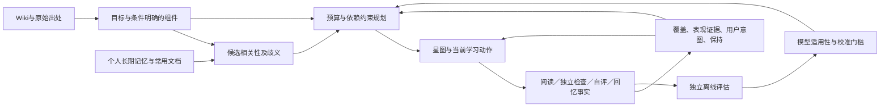

# 课题四：以证据边界约束个人学习闭环

2026-09-12。本文是四个切入点的联合选型与实施依据，取代“只调整节点粒度即可”的判断。实施、离线效果及真实学习收益分别验收，不把设计写成已经完成的能力。

本文的问题盘点记录改动前的证据；本轮已完成的弱信号修正和公开对照结果见 [实验结果与实施记录](实验结果与实施记录.md)。其余选型仍需按验收条件实现，不能将下文候选能力当成当前功能。

后续实施更新：组件候选关联、歧义分摊、依赖预算规划与真实页面验证见 [第二轮记录](关联与路径验证记录.md)。通用材料候选的边界与验证协议见 [材料候选协议](材料候选与验证协议.md)，不能把候选生成当成语义审核已经通过。

最终实施与基本要求核对见 [原型设计与验收](原型设计与验收.md)，其中也明确了未配置组件的页面回退范围。下文的问题盘点与候选比较保留为选型过程，不替代最终实现说明。

## 1. 问题、资料与验收范围

原题《WeKnora 开源实战课题》课题四要打通个人长期记忆与知识内容，让用户看到学习覆盖、薄弱处及下一行动。基本要求为：定义节点和掌握度、说明数据和评估；可运行原型；至少一种有效性验证；按租户隔离，用户可查看、导出、删除画像。原题允许只做部分切入点，本次目标则明确要求关联、度量、引导、呈现四项均研究和优化。

原题与 v3 设计报告已重新从 DOCX 正文提取核对，原件未修改；提取件位于 `.local-data/research/framework/`。`done/weknora-4q.md` 等初版材料用于识别假设和历史方向，不作为必须延续的算法约束。项目 Wiki、图谱文档说明：Wiki 是基于引文合并的知识页面，图谱关系服务检索；两者均不天然等于学习目标或先修依赖。没有发现独立学习者的本地答题或学习收益标注数据。

终端用户是希望快速理解个人知识库的人。优化对象是有限时间内完成有用的学习目标，同时减少错误点亮、盲目重复和不必要测验。点击率、停留时长、界面复杂度、模型名称不能单独充当成功标准。工程规模限制：复用当前 Go/Vue、事件仓储、Wiki 引用、长期记忆和 FSRS，不新增训练服务、向量库或深度模型依赖。

| 验收对象 | 必须证明什么 | 当前证据及缺口 |
|---|---|---|
| 关联 | 记忆与内容可映射，条件冲突不混淆，模糊联系不转成能力证据 | 组件/来源多对多已实现；组件动作归属已测；组件尚未接回长期记忆 |
| 度量 | 信号含义明确、可重放、避免主观打分与重复刷证据 | 事件和独立题族已实现；阅读累加与自评仍改变未校准指数，需纠正 |
| 引导 | 按目标、准备条件、时间、个人状态迭代；解释选择原因 | 预算与前置已贯通；固定加分及逐步贪心尚缺策略对照 |
| 呈现 | 星图准确表达覆盖和证据，能看懂原因与下一步 | 星图保留且联动；“估计熟悉”混合不同依据，需要分开 |
| 运行与数据权利 | 真实页面/助手可用；隔离、停采、导出、删除有效 | 既有工程验证通过；后续修改须做相应回归和真实页面验收 |
| 有效性 | 有明确基线、独立结果指标、可复现记录 | 旧公开答题实验有负面结果；尚无本地因果学习增益证据 |

## 2. 调研如何改变选型

知识追踪不存在一个在所有场景最优的模型。Gervet 等在九个数据集上比较模型，结果依赖数据规模和历史特征，且指出校准、知识组件质量及推荐策略都是关键限制。[1] LKT 对多种历史特征和模型进行统一比较，也没有发现通用赢家。[2] 因此选择“小型候选模型 + 留出评估 + 不适用时退回可解释规则”，不能因为 BKT 或深度追踪更像算法就直接上线。

课题要求避免主观掌握打分。没有本地标注时，公开数学答题参数无法自动成为企业文档理解概率。应分开：观察到什么、在何种假设下预测什么、用户自己希望跳过什么。该分离是本项目设计判断，不是文献保证的学习收益。

先修关系预测研究将它作为独立学习任务，需要特征、数据和评估，而不是把语义相似度直接变成有向依赖。[3] 当前规模不值得引入图神经网络：人工核对的依赖可以作为硬约束；自动候选关系先作为可见但不阻断阅读的软联系。

ALCE 区分引文是否支持生成内容，以及引文是否相关。[4] 当前“引文存在”校验只证明定位正确，不证明目标、适用条件或例子得到来源支持。不能用同一个生成模型的高自评分替代独立核对，也不能说加上引用就修复了 Wiki 内容质量。

间隔重复优化研究针对记忆保持与复习成本，依赖具体记忆模型；其自然实验不是本项目的随机试验。[5] FSRS 使用真实回忆反馈安排复习，官方文档也区分参数优化与用户评分的影响。[6] 这里继续复用 FSRS，但不把计时阅读伪装成回忆成功。

开放学习者模型研究支持让学习者看到模型依据并纠正系统判断，但现有研究场景和样本有边界。[7] 本项目保留星图，避免一个绿色节点同时暗示“读过、懂了、能应用、长期记住”。这属于可理解性设计，须由实际使用任务验证。

离线策略评估需要观察策略、动作概率和反馈之间的关系；有日志并不意味着可以识别另一策略的收益。[8] 当前没有随机探索概率与独立学习结果，不能用推荐点击回放或下一节点命中率宣称学习效率提升。

## 3. 联合框架：内容图、事实账本、预测器、规划器、学习视图

这不是五个新服务。内容定义和事件使用现有表；其他均为可测试的计算函数。预测器可替换，事实语义不随模型改变。先解决错误的证据路径，再比较更复杂模型是否值得。

### 3.1 关联：多粒度，但只有明确观察才进入能力账本

定义组件 `k=(id, goal, condition, explanation, example, sources, relations, version)`。主题是概览，组件是个人学习目标，Wiki/原文是支撑材料，chunk 是定位而非强制阅读单元。概念辨析、规则应用、因果解释和流程理解均可作为目标，不把所有材料改造成操作题。

同名异用分开，同义同用可合并并保留多来源。正文和条件缺失时，宁可显示来源待核对，不凭空补一个完整课程。目标与来源的直接关系要区分“定义依据”“适用条件”“例子依据”；当前作者样本尚未获得独立语义审校。

关联按用途分两条：

1. **表现归属**：用户直接在当前组件完成独立检查，只写当前组件和版本。开放问答若无法可靠定位目标，暂存未确定，不能广播整页。
2. **需求相关性**：个人主题到 Wiki、常用文档到来源、来源到组件形成候选多对多联系，仅影响排序和说明。共享一个来源的多个目标不能都声称“用户已经会”。

记忆来源 `m` 命中 `n_m` 个组件时，候选贡献按 `1/n_m` 分摊，单组件总加成设上限；不同来源重复提到同一件事不无限累加。该权重是资源分配规则，不是“映射正确概率”。候选关系带证据来源和歧义数，来源失效即撤出候选。租户、用户、知识库作用域必须在计算入口与仓储同时约束。

这能恢复原题的记忆桥梁，但不能解决自由文本语义归因的全部困难。后者需要“有映射/无映射/多个合理候选”的标注样本，报告准确率和覆盖率，避免只展示成功样例。

自动构造的可靠路径是：从来源提出组件候选 → 校验引用和结构 → 分开核对条件、例子、题目和依赖 → 发布可学习定义。候选阶段不写个人已会状态。现有 10 个作者组件只能作为流程样本，不能代替通用内容生成质量验证。

### 3.2 度量：把机会、证据、意图与保持拆开

个人状态为 `X(u,k,v,t)=(C,E,I,R)`：

- `C`：接触和有效阅读机会，来自前台可见阅读与服务端时间检查；自动记录。
- `E`：首次、未求助、按题族去重的独立检查及结果；预测只能使用结果产生前的历史。
- `I`：用户声明熟悉/困难和主动目标；表达其判断与选择，可改排序，不能自动增加独立通过次数。
- `R`：真实回忆事件驱动的保持与复习时间，不套用到尚无回忆的组件。

强制约束：任意增加纯阅读、重复题、求助练习或重复“我会了”，不得增加独立证据量；没有表现证据时不得把阅读次数换算成精准能力概率。星图仍可因接触和阅读而点亮，熟悉自评提供跳过便利，检查支持单独表达，用户无需为每个节点答题才能前进。

现有 `kc-bkt-envelope-v1` 的风险可以直接算出：每天一次阅读后 `m_d=1-(1-m_0)·0.8^(0.6d)`，即便没有任何答题，`d→∞` 时指数趋于 1，两个初值的差距也趋于 0。初值敏感性变窄不等于事实更可靠。“三个阅读日即熟悉”也只是手设门槛。本轮应取消弱信号对表现估计的这种自动确定化。

表现预测候选：

| 候选 | 用途 | 局限与退出条件 |
|---|---|---|
| 平滑的全局/技能答对率 | 必须保留的简单基线 | 对个体变化不敏感，未知技能回退全局 |
| BKT | 少参数的序列候选 | 潜在掌握不可直接观测；学习率、猜测率等未经本地校准不得当真实能力 |
| 正则化历史逻辑回归 | 使用个人过往成功/失败及技能难度 | 不加入无法迁移的新用户固定参数；未知技能退回共享历史特征 |
| 深度追踪 | 暂不采用 | 当前缺少对应规模和覆盖的数据，增加工程复杂度没有已证实收益 |

历史回归候选为 `logit p = b_k + β1 log(1+s_uk) + β2 log(1+f_uk) + β3 log(1+s_u) + β4 log(1+f_u)`，其中所有计数严格来自当前响应之前。正则化强度只在验证集选。它预测下一独立响应，不是直接测出理解，更不是学习收益模型。

模型选择的必要条件是：相对简单基线的留出损失改善、用户层不确定性、分组校准和适用数据范围。公开样本的参数不直接导入组件模型。没有本地支持时，正式视图显示事实与证据状态；实验性数字只在解释面板中注明适用范围，不能控制能力认证。

### 3.3 引导：约束先行，优化目标与真实收益分开

一次行动包含目标、动作、成本、依赖、原因和策略版本。候选动作是阅读完整解释/例子、可选情境检查、到期回忆。用户选择“已经熟悉”可减少重复阅读；阅读自动推进，检查只在关键不确定性影响后续学习时建议。

硬约束：来源可用、作用域有效、时间预算、已核对先修关系、同轮不重复；软信号：个人需求相关、近期困难、记忆到期、目标覆盖。跨多个组件的原始任务不默认给每个组件都记成功。

当前逐步贪心只看眼前的单位时间加分，可能选了短小无关节点，导致剩余预算无法进入高价值目标。候选改进是将目标与必要前置组成有序包，在预算内比较包的收益，使用有界搜索，并在小图上与穷举最优解比较。大图报告搜索宽度、截断与时间；不能宣称全局最优。

无学习收益标签时，效用只命名为“目标推进/复习优先级”：`U(plan)=覆盖目标的价值 + 有界需求相关加成 + 到期/困难处理价值 − 可避免重复成本`。不要把手设 `0.2` 学习率包装成真实预期增益。诊断应有独立预算，不能让所有已读节点排满测验挤掉学习。

每次实际动作后重新规划，计划中暂定完成前置不回写用户状态。模型将来若通过本地验证，可以替换收益估计；在此之前保留规则基线，避免为了上线 bandit 而制造并不存在的奖励。默认确定性规划的日志只能用于审计，不能支持未尝试动作的反事实价值比较。

### 3.4 呈现：颜色表达事实种类，图形服务决策

保留白绿简约风格与星图。主题分区承担概览，组件承载状态；箭头表示已核对前置，虚线表示相关。默认只突出当前目标及附近关系，避免大量连线形成视觉噪声；仍允许查看全局覆盖。

状态语义：未接触 → 已接触 → 已阅读；“自评熟悉”和“检查支持”分别呈现。困难/到期作为需要注意的提示，不抹掉已经发生的阅读事实。深绿色不代表永久掌握。来源失效时保留历史并明确暂停推荐。

右侧只回答三个问题：本轮去哪、为什么、动作后发生了什么。证据详情按需展开，显示真实次数、当前自评、最近检查与回忆到期，不默认堆放模型参数。用户可以继续阅读、跳过已熟悉内容、反馈困难、选择检查，而不必先理解贝叶斯公式。

## 4. 可复现实验与不允许跨越的结论边界

| 层 | 对照/反例 | 主要结果 | 能证明与不能证明 |
|---|---|---|---|
| 关联 | 同页多目标、同名异用、跨源同义、模糊/失效/越权来源 | 归属正确性；人工样本准确率与覆盖率 | 程序边界不等于自动语义正确 |
| 度量 | 旧 CT 实验 + 新 AS 数据；均值/BKT/历史回归 | Log loss、Brier、用户宏平均、校准、用户层 bootstrap | 预测有效性不等于文档学习或因果收益 |
| 度量反例 | 0/1/3/30/365 个阅读日，无独立检查 | 指数、敏感范围、显示状态、证据量 | 检验不合理自动确定化，无需真实学习标签 |
| 引导 | 贪心/依赖包搜索/小图穷举 | 同一效用下差距、约束违反数、规模耗时 | 证明给定目标下规划质量，不证明效用就是学习收益 |
| 呈现 | 固定状态任务，说明“依据/下一步/变化” | 误解、操作次数、迷路、重复学习 | 自动测试保同步；真实试用验证可理解性 |
| 最终学习 | 等时长、不同但匹配材料，新任务与延迟任务 | 单位时间独立任务、延迟保持、重复成本 | 当前尚未开展，不虚构结果 |

新的公开实验在运行指标之前冻结协议：固定数据提交、用户分割、候选及超参、指标、训练/验证/测试角色、排除规则、随机种子和结论边界。已经看过的 CT 测试结果视为探索性数据；新 AS 留出用于新增外部检验。两者均是数学练习，不构成跨到企业知识学习的证据。

强基线已经给出警示：旧实验 16,857 条记录中，测试集技能均值 Log loss 约 0.62812，训练拟合 BKT 约 0.62888，手设 BKT 约 0.66557；BKT 没有胜过均值。保留此结果，后续新增模型不能删除它或把验证集筛选结果写成独立测试。新协议不会重新命名旧结果来伪造首次留出。

## 5. 实施顺序与完成条件

1. 用当前生产投影函数复现弱信号过度确定化，保存原始审计结果；完成公开预测模型对照。
2. 改正度量和显示语义，保留自动阅读进度和用户跳过能力；对旧事件重放，不修改原始事实。
3. 恢复记忆到组件的候选关联，控制歧义扩散、权重上限、租户和个人边界；展示相关理由。
4. 将固定贪心升级为可比较的依赖预算规划，完成与穷举/简单基线的对照；真实动作后重新规划。
5. 形成通用候选材料的质量边界和跨主题样本验证；审查现有硬先修关系的来源依据。
6. 同步星图、行动区、助手与导出；按启动说明运行，完成相应工程回归与真实页面任务。

整体验收时必须重新读取当前代码、实验产物和真实运行状态，逐项判断上述要求。研究报告、测试通过、漂亮界面都不能单独使整项任务完成。本地学习收益若尚未获得，必须明确写“尚未验证”，不能用公开预测指标替代。所需的最小原型仍必须在四个角度形成闭环。

## 参考资料

[1] Gervet et al. (2020). *When is Deep Learning the Best Approach to Knowledge Tracing?* JEDM 12(3). https://theophilegervet.github.io/assets/pdf/gervet2020deep.pdf

[2] Pavlik Jr., Eglington & Harrell-Williams. *Logistic Knowledge Tracing: A Constrained Framework for Learner Modeling*. https://arxiv.org/abs/2005.00869 （论文版本与期刊年份应区分。）

[3] Pan et al. (2017). *Prerequisite Relation Learning for Concepts in MOOCs*. ACL. https://aclanthology.org/P17-1133/

[4] Gao et al. (2023). *Enabling Large Language Models to Generate Text with Citations*. EMNLP. https://aclanthology.org/2023.emnlp-main.398/

[5] Tabibian et al. (2019). *Enhancing human learning via spaced repetition optimization*. PNAS. https://doi.org/10.1073/pnas.1815156116

[6] Anki 官方手册，FSRS 与复习选项。https://docs.ankiweb.net/deck-options.html#fsrs （访问：2026-09-12。）

[7] Bull (2016). *Negotiated learner modelling to maintain today's learner models*. https://link.springer.com/article/10.1186/s41039-016-0035-3

[8] Dudík, Langford & Li (2011). *Doubly Robust Policy Evaluation and Learning*. ICML. https://icml.cc/2011/papers/554_icmlpaper.pdf

本地工程依据：`website-docs/03-features/14-wiki.md`、`09-knowledge-graph.md`，`internal/application/service/learning/component.go`、`path_relevance.go`，以及此前的 `docs/research/learning-model/组件原型实现与验证.md`、`public-bkt-results.json`。参考文献支持选型理由，不代表本项目已经复制其效果。
