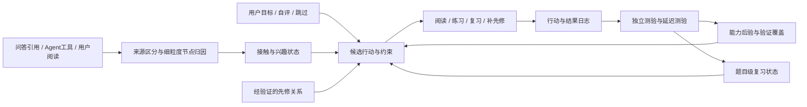

# WeKnora 课题四：代码质量、算法选型与改进评估

评估日期：2026-09-08。评估对象：`F:/study/WeKnora` 当前工作区，包含尚未提交和未跟踪的课题四代码。HEAD：`212f4826fca380f281a75323418868aaf115f2ae`。本文是审查与方案建议，没有改动产品代码，没有执行提交、打标签、推送或发送邮件。

## 1. 总体判断

**当前成果已经具备较完整的课题四原型结构，工程投入和产品覆盖都较充分；主要短板是掌握度模型的语义与更新规则、证据映射精度，以及有效性评估的可信度。现在不宜宣称已证明学习效果提升，也不值得为了“算法先进”整体推翻实现。**

更合适的下一版：保留 Wiki 页面节点、个人事件账本、确定性判卷和可解释推荐；分开记录接触/兴趣与经验证能力；先修复确定性缺陷，再用独立测试数据比较轻量知识追踪和标准间隔复习方案。

“有没有十分优于当前选型的方案”的答案分两层：

- 有一些针对现有失效机制明显更合理的设计，例如细粒度证据归因、按时间先预测后更新、分离浏览与掌握状态、可重复跨日验证。这些值得立即改。
- 没有查到能据此断言“在你的数据上显著优于当前系统”的现成算法。BKT、FSRS、HLR、AKT、图检索算法分别解决不同子问题；是否显著优胜必须在本项目的独立数据上比较。

## 2. 文档要求、项目背景与评估边界

阅读了两份指定文件的正文及表格：

- [实战流程指引](F:/大厂计划！/Weknora/WeKnora_腾讯犀牛鸟_课题实战流程指引_2026.docx)。最终截止是 **2026-09-13 00:00，北京时间**，即 9 月 12 日结束时。代码成果需仓库链接、最终 Tag、完整 SHA、README、运行/测试说明和 submission.yaml。
- [课题四要求](F:/大厂计划！/Weknora/WeKnoraq4.docx)。课题为“知识网络与引导式学习”，开放探索、高难度；四个切入角度可以只做部分。底线是设计说明、可运行原型、一种有效性验证，以及按租户隔离、用户查看/导出/删除学习画像。

以上是评估依据，不是本次执行 Git 操作或发邮件的授权。文档中的示例命令没有执行。

代码沿革中，`63147224` 是集中引入课题四的提交，其父提交 `412dcc41` 的 VERSION 为 0.7.2。因此以该父提交为局部差分基线，比把今天所有 Wiki/RAG/记忆代码都算作课题四贡献更准确。针对该基线，当前已跟踪文件差分约 116 个文件、24,161 行新增、49 行删除；**这一数字不包含未跟踪文件，也不等于算法复杂度或成果质量**。网页仓库亦说明 v0.7.2 已有 Wiki、图谱、记忆等底座。[用户仓库](https://github.com/Lh0326/WeKnora/tree/main)

实际重点审查了 learning 的采集、映射、折叠、遗忘、门控、推荐、出题、判卷、回填、对账、组织视图、仓库与路由，以及学习页、星图、Wiki 阅读采集和 learning-bench。Wiki ingest、问答及 Agent 接入点按新增差分检查。没有将所有上游模块作为完整安全审计对象。

## 3. 按课题四的四个角度评价

| 角度 | 已实现的主要能力 | 质量判断 | 主要缺口 |
|---|---|---|---|
| 关联 | entity/concept Wiki 页面作为节点；引用 chunk / SourceRefs 映射；记忆话题候选与 LLM 裁决；历史 affinity 回填 | 选粒度合理，可追踪原始材料，接入成本低 | 文档回退会扩散归因；前缀召回漏掉语义同义；Agent 阅读与人阅读混用事件 |
| 度量 | 固定权重累加 logit；幂律衰减；直接测验证据门槛；低证据标记；自评与跳过 | 比“让模型直接打掌握分”更易解释和测试 | 状态更新与时间语义有缺陷；概率未校准；题库晋级死角；题目正确性仍受 LLM 影响 |
| 引导 | 先修门槛、补盲、复习、错题、自我验证、兴趣、文档顺序、承接、探索、绕行 | 冷启动时可落地、理由丰富，已有完整反馈路径 | 规则叠加较多；局部贪心列表不是全局学习计划；先修与题库错误会阻塞学习 |
| 呈现 | Wiki 图层、分区星图、节点档位、低证据样式、最近变化、推荐理由、时间线、练习入口 | 四个方向中完成度较高；分区和折叠有助于控制密度 | 隐藏再返回丢阅读计时；空间布局不能解释为语义距离；缺少真实用户可用性证据 |

### 做得好的设计应当保留

1. **复用 Wiki 页面作为可操作节点。** 用户能从节点直接打开正文、出处、练习。以 chunk 为默认学习单元容易碎片化，以图谱实体为默认单元又未必有完整可读内容。当前粒度适合作为原型第一版。
2. **明确区分生成与评分。** LLM 主要负责话题映射、先修关系和题目生成，服务端比较选项得到判卷结果。这是良好的职责边界，但不意味着题目答案本身已获客观验证。
3. **有事件账本和派生状态。** 可解释为何点亮、可导出历史、可重建状态；这是后续替换模型最有价值的资产。
4. **有全局开关、KB 开关、主体上下文与 RBAC 接入。** 学习路由不接受任意 subject 参数，仓库的普通画像查询绑定 tenant / subject / KB；组织视图另加权限。这些与原项目结构较一致。
5. **没有只做漂亮图谱。** 推荐、练习、反馈、自评、跳过、遗忘提示和时间线均有落实。
6. **对冷启动和失败降级做了考虑。** 包括回填折扣、低证据提示、阅读去重、跨日门槛、循环与悬空边处理、画像删除后的回填标记等。不过部分保护没有贯穿所有路径，下面逐项说明。

## 4. 优先修复的问题：带触发条件和证据

本文 P1 表示会直接影响画像控制、核心状态或效果结论，应在最终提交前优先处理；P2 表示重要的正确性/可靠性问题，按时间安排。测试结果与源码判断分开标明。

### P1-A：停止采集没有覆盖后台话题映射

位置：[maintenance.go:45](F:/study/WeKnora/internal/application/service/learning/maintenance.go:45)、[maintenance.go:135](F:/study/WeKnora/internal/application/service/learning/maintenance.go:135)。

`RecordAnswerTouches`、`RecordWikiRead`、答题写入和 backfill 会查询 `collectionDisabled`；`runTopicMapping → mapTopicsForScope` 没有该检查。后台直接枚举长期记忆话题与 affinity，调用模型、写映射、写 topic_signal 并折叠状态。

**触发：**用户停止采集，或删除画像并停止采集；原记忆话题和文档 affinity 仍在；下次后台维护时有可映射节点。由此仍可能生成新画像数据。现有回填 tombstone 只保护 backfill 通道，不能保护 topic mapping。

**建议：**在进入任何个人数据投影前统一检查采集状态，写入前再做必要的版本/删除代际检查；模型调用也应被挡住。删除与停采设置应有明确原子边界。补“删除后运行全部后台维护仍无画像复生”的跨模块回归测试。

证据状态：源码路径明确；完整服务反例已准备，但本机依赖启动失败，未宣称运行通过或完整复现。

### P1-B：校准损失把同一答案提前计入预测

位置：[optimize.go:162](F:/study/WeKnora/cmd/learning-bench/optimize.go:162)、[read.go:716](F:/study/WeKnora/internal/application/service/learning/read.go:716)。

在线提交用同一个 `now` 写 `AnsweredAt` 与 `OccurredAt`。`quizLogLoss` 只有遇到 `ev.OccurredAt.After(attempt.AnsweredAt)` 才先评分；相等时先折叠该答案，随后再评价这个答案。因此标签进入了特征状态。

**隔离执行反例：**没有历史，唯一一次答对，时间戳相等。正确的初始预测按现有 prior 应为 0.5，对数损失 `0.693147`；当前代码得到 `0.105083`，对应已经看过本次正确答案后的预测。

还有三个独立问题：

- `runFit` 在同一输入上优化和报告改善，没有独立验证集；1% 改善阈值不是显著性检验。
- 分组键仅为 `(subject, slug)`，没有 tenant 和 KB；同一人的跨 KB 同名节点可能混入同一条轨迹。
- `refoldWeight` 按 slug 的累计次数折减，在线判卷按“同题、48 小时内”计数；零权重阅读也会被重新赋予正权重。调参使用的状态模型不等于线上模型。

本地旧 `opt-report.json` 显示 92 条事件、16 次作答和约 35.94% 损失下降。**它只能称为旧拟合输出，不能作为泛化改善或学习效果改善证据；必须修正后重算。**

**建议：**每次尝试先用严格在它之前的事件预测，再写当前答案；补事件序号/attempt ID 消除同时间戳歧义；用完整作用域分组；复用线上更新器；按用户与时间分离训练、验证、测试，报告 Brier、log-loss、校准图及样本量。`unsure` 不应未经定义就当作普通错误标签混入校准。

### P1-C：首日做完题库后，后续间隔练习无法解锁“掌握”

位置：[gate.go:39](F:/study/WeKnora/internal/application/service/learning/gate.go:39)、[gate.go:80](F:/study/WeKnora/internal/application/service/learning/gate.go:80)、[quizgen.go](F:/study/WeKnora/internal/application/service/learning/quizgen.go)。

每个节点默认保留 3 道活跃题。门槛只保留每题**第一次答对**的时间，用不同题首次正确时间跨度达到 48 小时作为晋级条件。

**隔离执行反例：**三题首日都答对，72 小时后全部再答对，门槛仍为 `familiar`。只要题库不换题，这种学习轨迹后续永远不能通过该门槛。它事实上奖励“留一道题以后第一次答”，而不是稳定的延迟提取能力。

**建议：**分别统计知识覆盖面与跨时段验证：至少若干不同题/知识组件 + 至少两个相隔满足条件的有效测验时段。跨日复答可以参与保持验证，同一次答案展示后的即时重答不算独立证据；题目升级需关联版本和等价题组。

### P1-D：长期未复习后答错，掌握数值可能突然上升

位置：[fold.go:14](F:/study/WeKnora/internal/application/service/learning/fold.go:14)、[decay.go](F:/study/WeKnora/internal/application/service/learning/decay.go)。

当前先在旧 logit 上加负权重，再把最近证据时间推进到现在。上一次积累的高 logit 没有先吸收已经发生的遗忘，而新的时间锚点把遗忘因子重置为 1。

**隔离执行反例：**先连续三次答对，180 天无事件，再答错一次。`p_eff` 从 `0.557174` 升到 `0.924142`。这里演示的是内部概率数值，并不代表一定越过直接证据门槛，但概率反馈、推荐和复习时间都会受影响。

**建议：**明确区分“测验前可提取概率”“观察对错后的能力后验”“看反馈后的学习收益”。更新必须显式包含经过的时间；普通浏览不能重置已经验证的记忆状态。可以实现时间感知 BKT，也可以让经过验证的题目进入独立标准 FSRS 调度层。

### P2-A：逐事件截断使“事件交换顺序不影响结果”的承诺不成立

位置：[fold.go:14](F:/study/WeKnora/internal/application/service/learning/fold.go:14)、[model.go](F:/study/WeKnora/internal/application/service/learning/model.go)、[reconcile_runner.go:499](F:/study/WeKnora/internal/application/service/learning/reconcile_runner.go:499)。

注释认为加法和计数可交换，但每一步都截断到 [-4,4] 后，加法已经不具备该性质。

**隔离执行反例：**同一组 `+2.2,+2.2,-1.5`，顺序一得到 logit 2.5，负事件先到则得到 2.9。后台按时间重放与在线按到达顺序更新可能不同；同一时间戳没有稳定排序键也会产生歧义。

**建议：**不要要求真实学习过程与顺序无关。要求“相同有序事件流可确定重放”更合理：稳定事件顺序、完整作用域、算法版本、状态版本、重放检查点。若仍保留纯累加模型，应存未截断累计量并仅在读出时截断，但它不能解决上一条的时间语义问题。

### P2-B：精确 chunk 引用仍会扩散到同文档其他概念

位置：[collect.go:121](F:/study/WeKnora/internal/application/service/learning/collect.go:121)。

当前针对每个节点，chunk 不命中时继续查 SourceRefs 文档命中；没有限制文档级回退的场景。因此“引用来自同一文档”被当作“涉及本节点”。

**隔离执行反例：**A 只引用 c1，B 只引用 c2，两者都来自同一本书；答案只引用 c1，返回 touched 节点却为 `[A,B]`。

**建议：**有细粒度证据时优先在该文档内做精确归因，不能给未命中的兄弟节点同等正证据。纯文档引用只形成低置信接触候选，通过内容验证、信息量加权或归一化分配后再进入状态。一个答案涉及多节点并非错误，错误在于缺少支持该节点的证据。

### P2-C：先修关系的批内环检测有遗漏

位置：[maintenance.go:268](F:/study/WeKnora/internal/application/service/learning/maintenance.go:268)。

每条新边只与进入本轮前的 `existing` 比较，写入成功后没有把它追加到当前校验图。因此同批 A→B、B→A 都可能通过。读端虽把循环成员降级为可学习，系统仍可能保留相互矛盾的先修解释。

**建议：**对旧图和本批候选联合检查；每接受一条边就更新临时邻接表，或以置信度排序后构建 DAG；结合 SCC 找出循环并保留审核证据。单次全图 SCC 是 O(V+E)，比当前对每个节点重复 DFS 的最坏 O(V(V+E)) 更适合大图。

同时，`edgeBatchSize=40` 没有在 `runEdgePass` 中真正分批，最多 400 对候选一次进提示；按字典序裁掉后面的候选会影响覆盖。`firstSentences` 使用 `SplitAfterN` 后又拼回所有部分，并未实现所宣称的摘要截断，应使用按字符/token预算的明确截断。

### P2-D：题目与知识版本之间缺少充分绑定

位置：[quizgen.go:29](F:/study/WeKnora/internal/application/service/learning/quizgen.go:29)、[maintenance.go:356](F:/study/WeKnora/internal/application/service/learning/maintenance.go:356)、[read.go:681](F:/study/WeKnora/internal/application/service/learning/read.go:681)。

题目校验检查格式、A–D、答案键、解释非空和引用 ID 属于页面。这证明引用存在，**不能证明引用支持标准答案，也不能保证四个选项只有一个正确**。节点已有 3 道活跃题便不再生成，内容更新时的题目重审路径在此主流程中没有落实。

重答权重降到 25% 后不再减少，且答案会返回给用户；反复提交仍可累加到上限、提高稳定性。直接门槛限制了档位，却没有阻止底层状态被刷高。

**建议：**题目附 node/content/chunk 版本；内容变更后失效重审；区分首次作答、看过答案后的纠错、跨日复习；即时练习可给反馈，但不持续增加独立掌握证据。建立人工审核的小型稳定题库，单独统计答案支持率、单选唯一性、节点覆盖率与歧义率。

### P2-E：事件、测验、状态写入缺少统一原子性

位置：[read.go:724](F:/study/WeKnora/internal/application/service/learning/read.go:724)、[service.go:503](F:/study/WeKnora/internal/application/service/learning/service.go:503)、[repository/learning.go:54](F:/study/WeKnora/internal/application/repository/learning.go:54)。

`InsertAttempt → AppendEvent → UpsertMastery` 是独立操作，进程内锁不能保护多实例，也没有请求级幂等键。后台重放不使用同一把节点锁；它又以已有 mastery/skip 等行发现主体，首次事件成功而首次状态失败的主体可能暂时无法被发现。

**建议：**单库采用事务 + 唯一事件键 + 乐观版本或数据库行锁；将事件视作事实来源、状态视作可重建投影。后台从事件发现待处理范围，以游标增量重放，避免全量扫描和覆盖新状态。用户部署为单实例时可暂缓多实例优化，但报告必须给出这个边界。

### P2-F：隐藏标签页再返回会丢失阅读采集

位置：[readTracker.ts:30](F:/study/WeKnora/frontend/src/views/knowledge/wiki/readTracker.ts:30)、[readTracker.ts:56](F:/study/WeKnora/frontend/src/views/knowledge/wiki/readTracker.ts:56)。

`document.hidden` 时调用 `settle()` 清空 `currentSlug`；恢复可见时又依赖 `currentSlug` 非空来重新 `enter`，该分支无法恢复原页面。

**实际执行反例：**阅读 2 秒后隐藏，返回同页后可见停留 6 秒，应该产生 normal 阅读记录，实际记录为空。

**建议：**分开维护“当前页面身份”和“当前可见计时段”。隐藏时结束计时但保留页面身份；恢复时开启新计时段。补正常/快速翻页、隐藏返回、卸载、深读恰好越界等状态机测试。

## 5. 更根本的算法问题

### 5.1 当前实现应准确命名为“启发式证据评分 + 借鉴 FSRS 的遗忘曲线”

当前公式为：

\[
z_{t+1}=clip(z_t+w_e,-4,4),\quad
S=\max(1,14\sqrt{1+0.35n_+}\,0.85^{n_-}),\quad
p_{eff}=\sigma(z)(1+\tfrac{19}{81}\Delta t/S)^{-1/2}.
\]

幂律形状来自 FSRS-4.5，但 S 由正负事件计数人为构造，没有标准 FSRS 的 D/S/R 动态。读同一页和答对新题只要都算正事件，就对 S 的计数增长贡献相同；事件权重的小折扣没有同比折扣稳定性贡献。其参数也没有因使用 sigmoid 就自动获得概率意义。

标准 FSRS 的状态更新使用难度、稳定性、可提取率和复习反馈，当前官方说明还包含 FSRS-6。选择旧曲线本身不构成错误，**借用了曲线不等于复现并验证了完整算法**。[FSRS 官方算法说明](https://github.com/open-spaced-repetition/awesome-fsrs/wiki/The-Algorithm)

### 5.2 活动、兴趣、能力和记忆保持不是同一个变量

- 问答引用：说明答案利用了材料。
- Agent 读取 Wiki：说明工具使用了材料。
- 用户前台阅读：说明用户接触了材料。
- 反复追问：可能困惑，也可能深入讨论；当前只按时间/节点分类，无法区分。
- 独立答对审核过的题：较强的能力证据。
- 延迟之后仍能作答：较强的记忆保持证据。

当前 `wiki_tool_read` 同时用于 Agent 与用户阅读，并被推荐组装当作真实用户 visit/continuity 信号。应拆分来源，避免 Agent 查阅但未实际呈现给用户的材料改变其学习轨迹。

建议保留至少三类状态：`exposure/interest`、`verified competence`、`retention`；自评单独显示为用户声明。没有答题证据时呈现“尚未测量”，而非真实能力为零。`LowConfidenceEvidence<3` 是证据数量提醒，不是统计置信区间。

### 5.3 关联和先修图的上限受候选召回约束

话题匹配只用标题/别名/slug 的相等和前缀关系，最多取 8 个；候选按 slug 排序截断。一个不共享字符串前缀的同义表达不会进入 LLM 裁决，再强的模型也补不回来。提示里主要是名称，遇到同名异义又缺少充分上下文。

推荐做法：别名精确匹配 + 词法检索 + 语义向量召回，合并去重后重排，给裁决器看摘要与可核对的证据。向量只用于候选发现，不能直接把相似度当掌握度。[Sentence-BERT 原论文](https://aclanthology.org/D19-1410/)

同时，上传时间 + chunk 位置只是一种材料顺序启发，不等于课程难度顺序。跨文档先后最好来自显式课程目标、目录或先修关系；缺少数据时可保留当前回退，但理由应称“按材料顺序”。

## 6. 候选方案比较与推荐组合

以下是基于本项目数据条件的选型判断，不是已经完成的效果实验。

| 候选 | 更适合解决的问题 | 相比当前实现的潜力 | 当前是否建议 |
|---|---|---|---|
| 细粒度归因 + 混合召回 + 证据重排 | 记忆/引用与知识节点映射 | 减少整本文档扩散，增加同义表达召回 | 立即优先做小范围 A/B |
| 分通道状态 + 轻量 BKT，必要时加时间遗忘 | 从答题观察估计能力 | 将猜测、失误、学习转移与能力后验分开，定义更明确 | 推荐作为能力模型对照版本 |
| 标准 FSRS，按题目/知识组件维护 | 已学习材料的复习时间 | 比单纯正负计数更能表达间隔与遗忘后的状态更新 | 推荐独立用于复习层，先采用明确版本与默认参数 |
| HLR | 用可解释特征拟合记忆半衰期 | 可表达练习次数、间隔和项目特征，成本相对低 | 有规范延迟测验日志后比较 |
| 先修约束下的目标覆盖 + MMR/次模近似贪心 | 排出互补、可完成的下一组学习行动 | 减少多个同义/相邻节点重复占位，显式考虑耗时与目标 | 推荐先实现简单可解释版本 |
| LinUCB / contextual bandit | 长期个性化选择行动 | 可从收益反馈学习策略，而非手工不断加权 | 暂缓；先记录曝光、行动概率和学习收益 |
| AKT 等深度知识追踪 | 大量、规范的多用户题目交互 | 可学习复杂交互序列与题目关联 | 当前不优先，现有小样本不足以支持本地训练结论 |
| GraphRAG / LightRAG / HippoRAG | 图驱动检索、摘要、多跳问答 | 可提升底座某类问答或关联候选 | 不能直接替代用户能力模型，不作为课题四全面重写理由 |

**BKT 的价值在于问题定义更清楚，而非年代新旧。**它估计潜在知识状态，再用猜测/失误模型解释答题观察；其假设也需要检验。四选一随机猜中的比例可以作为猜测参数的参考，但不能盲目固定成对所有题都真实的 0.25。[Corbett 与 Anderson 原论文](https://link.springer.com/article/10.1007/BF01099821)

**HLR 适合做可训练、可解释的记忆模型对照。**原研究在语言学习场景中提出可训练半衰期回归；场景不同，不能直接把该论文收益数字移植为企业知识学习收益。[Settles 与 Meeder 原论文](https://aclanthology.org/P16-1174/)

**AKT 是需要交互数据来学习的序列模型。**本项目最紧迫的问题是标签、题目质量与评估协议，深度模型不会自动修复它们。[AKT 原论文](https://arxiv.org/abs/2007.12324)

**GraphRAG 与用户知识追踪的“记忆”不是同一对象。**GraphRAG 聚焦语料级问题的图索引与摘要，HippoRAG 聚焦模型检索记忆与多跳问答；后续 HippoRAG 2 也仍是 RAG 到模型记忆的路线。这些可作为底座演进参考，不能据此宣称更准确知道用户懂什么。[GraphRAG](https://arxiv.org/abs/2404.16130)、[LightRAG](https://arxiv.org/abs/2410.05779)、[HippoRAG](https://arxiv.org/abs/2405.14831)、[HippoRAG 2](https://arxiv.org/abs/2502.14802)

### 推荐的下一版结构

技术上可逐步增加 `source_kind`、稳定 node ID、内容版本、attempt ID、事件幂等键、算法版本与状态序号。**节点 ID 保持稳定，slug 是可变地址**，可减少改名/合并后门槛、题目、时间线与画像不同步的难题。现有页面、API 和图形组件可以继续使用。

推荐器可先拆成“资格检查 → 候选召回 → 可解释特征 → 排序 → 多样性和时间预算 → 原因生成”。不要继续把所有产品需求叠进一个大函数，也不要一次引入无法验证的强化学习系统。

## 7. 有效性验证应如何补齐

### 7.1 当前 bench 证明了什么、没有证明什么

`simulate/verify` 多数为构造轨迹、约束和格式规则检查；能证明这些样例上的程序行为，但不证明真实用户知识状态准确。`walk` 是模拟用户走 API，可证明流程连通，仍不是学习效果试验。

`replay` 目前存在：

1. 状态按 slug 折叠，没有用户/KB/租户分组；多主体输入会混合。
2. 只从全部历史事件构造节点全集；未来才访问的节点被提前知道，始终未访问的节点却完全不在候选全集。
3. `hasQuiz` 利用后缀事件；若以历史时点为评估基准，会引入未来信息。
4. 基准适配器没有传入生产策略中的 SelfAssess、DocOrder、Skips、Recent、Material、LastVisit；replay 调用也没构建 DirectFacts。测的不是现在完整策略。
5. random 只从未访问节点抽样，目标却包含重复访问；与推荐器、热度基线的候选资格不一致。
6. 静态评估使用当前时间；不同日运行会因遗忘产生不同结果。“静态冻结列表”实际每个目标又调用一次含随机探索的 ranker。
7. 零权重事件在 replay 中照样折叠，而在线主路径跳过；`-refold` 进一步改变去重、重答语义。
8. 命中下次触达只表示行为预测，不代表学得更好；后台 topic/backfill 等事件也不应成为用户下一次行动标签。

位置：[replay.go:118](F:/study/WeKnora/cmd/learning-bench/replay.go:118)、[replay.go:382](F:/study/WeKnora/cmd/learning-bench/replay.go:382)、[bench_export.go:23](F:/study/WeKnora/internal/application/service/learning/bench_export.go:23)。

### 7.2 最小可信评估组合

| 层次 | 数据与基线 | 建议指标 |
|---|---|---|
| 关联 | 人工标注的记忆/引用→节点；包含同文档不同概念、同名异义、同义词、无对应节点 | Recall@K、Precision、错误点亮率；精确引用与文档回退分别报告 |
| 先修关系 | 人工审核有向边，明确 related 与 prerequisite；覆盖反向边和跨章节 | Precision、方向正确率、覆盖率、环数量、误阻塞比例 |
| 掌握预测 | 按时间隔离的首次/延迟测验；排除已看答案的即时重答；按用户分层 | Brier、log-loss、可靠性曲线；未测量比例；分题目/节点/人汇总 |
| 推荐 | 所有方法使用相同历史时点全集与权限；随机、材料顺序、热度、当前规则、改进版 | HR/NDCG/MRR 仅作行为指标；另测覆盖、卡死率、耗时、多样性 |
| 学习效果 | 小规模同意试用；等时长；前测/后测/延迟测；尽量匹配或随机分组 | 后测增益、延迟保持、单位时间收益、负担与可解释性 |

关联标注可先从 100–200 个跨类别样例起步；先修边可先审核 50–100 对。这些是可执行的工作量建议，不是保证统计充分的样本阈值。真实试用也可以很小，但应报告参与者数、题目数、分组方式与不确定性，不能把一个人的多次点击当成大量独立用户。

消融至少比较：精确 chunk vs 当前 OR 回退；活动分与能力分合并 vs 分离；固定权重 vs 轻量 BKT；当前衰减 vs 标准复习模型；纯材料顺序 vs 当前推荐。每次只改变一个主要因素，先声明主指标。

未来若尝试 bandit，必须先有可识别的曝光记录、选择概率和结果。仅凭“用户最终点了什么”的日志无法无偏估计另一个推荐策略带来的收益。[离线 bandit 评估原论文](https://arxiv.org/abs/1003.5956)

## 8. 这次实际运行的验证与局限

- 前端现有四组相关文件共 **36 项测试全部通过**：星图布局、图层颜色、助手视线与 knowledgeTrace。
- 原模块 Windows Go 测试在运行启动阶段退出 `0xc0000139`；不能记为通过，也不能据此认定业务断言失败。仓库的测试脚本已记载本机原生依赖问题，具体此次启动原因没有进一步定位。
- 尝试使用现有 Go 测试镜像；新容器停在 Created，未得到后端测试断言结果。
- 为避免把环境问题误作产品问题，提取并直接复制当前相关计算函数，配最小数据类型替身，构建只依赖标准库的隔离 Go 包。**这不是完整服务/数据库测试**。五个新增业务不变量反例均按预期暴露缺陷：到达顺序、全题库跨日重答、文档扩散、长期遗忘后答错升分、同时间戳校准泄漏。
- 对实际 `readTracker.ts` 用模拟时钟和 visibility 事件执行，确认隐藏返回反例失败。
- 话题映射停采遗漏、同批环边、事务与题目版本问题属于源码审查结论；准备的完整服务反例尚未因本次环境执行完成。
- 没有进行真实用户学习实验、真实 LLM 题目正确率抽检或浏览器整页性能测量，不能把源码与单测替代这些证据。

隔离测试材料保存在 [本次审查目录](F:/study/WeKnora/.local-data/q4-audit-20260908)，结果在 [isolated-results.txt](F:/study/WeKnora/.local-data/q4-audit-20260908/isolated-results.txt)。`learning_audit_test.go` 与 `optimize_audit_test.go` 还可通过 overlay 加载进真实模块，供依赖环境恢复后运行；这些断言当前应失败，修正后才应转绿。

## 9. 提交前最有价值的工作顺序

1. **先守底线和核心正确性：**补齐所有路径的停采/删除保证；修校准标签泄漏；修跨日门槛；修时间感知更新；修阅读恢复和批内环检查。冻结新 UI 扩展。
2. **再修证据与对照：**限制文档回退；区分 Agent/人类来源；审核一小批题目与映射；让 bench 复用生产状态更新和完整推荐输入，保留独立测试集。
3. **用已有框架交付可信结果：**保留能解释的现有规则作为 baseline，只增加一个有明确假设的改进版本。失败或无显著差异都如实报告。
4. **完成材料一致性：**把实际设计、启用方式、部署边界、测试命令、数据定义和已知局限写进可交付文档。当前检索到的报告构建稿位于 `.local-data`；已跟踪 README 未见完整课题四专章，本次也未发现已跟踪 submission.yaml。最终代码和材料需要另行整理、提交和固定版本。

文档中应避免“完整实现 FSRS”“确定性判卷所以完全客观”“事件任意顺序都一致”“校准下降 35.9% 证明有效”“四方向全部满足所以已完成验收”这类超出证据的表述。

**适合最终成果的定位：基于 Wiki 知识节点、可追溯学习证据和可解释引导策略的企业知识学习原型；通过直接测验约束能力声明，并用明确的离线/小规模试用验证其边界。**这比继续增加功能种类，更能提高课题四成果的说服力。
